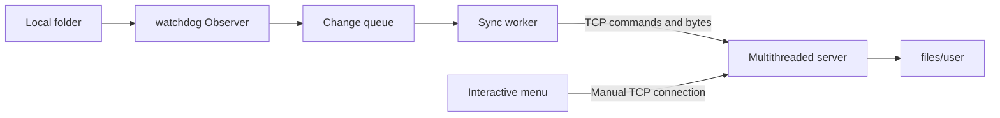
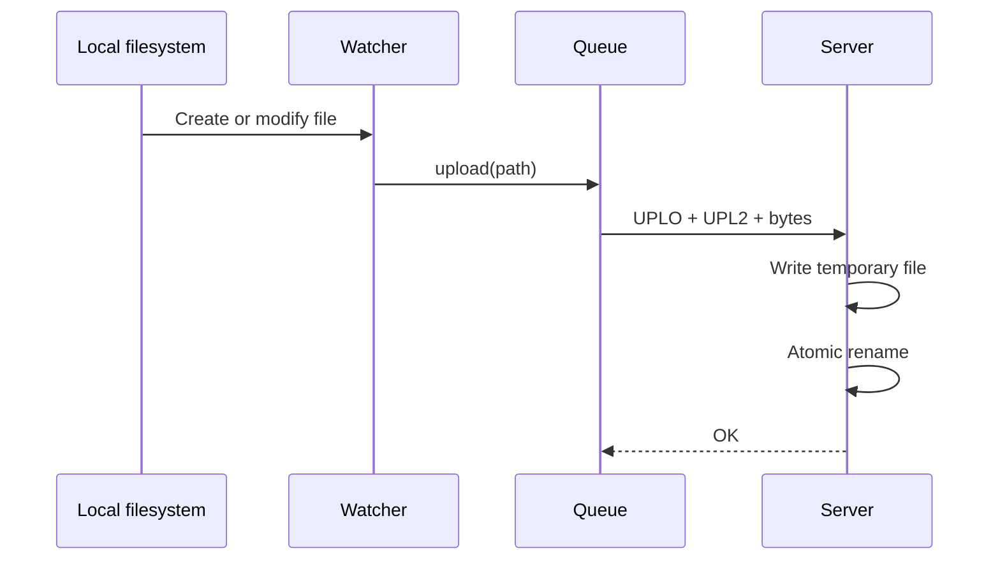

# Architecture

The service uses a multithreaded server and a dedicated synchronization connection from each client.

## Client

`SyncWorker` watches the configured local folder. `ChangeHandler` converts filesystem events into queue entries:

- created and modified files become uploads;
- deleted files become delete operations;
- moved files become a delete followed by an upload;
- directories are ignored.

The worker coalesces repeated events for the same path and waits for the file size and modification time to stabilize before uploading. A separate socket prevents automatic synchronization from competing with the interactive menu connection.

## Server

`serv_fich_multithread.py` accepts client connections and starts one thread per session. After authentication, files are stored under `files/<username>/`.

Uploads are received into a temporary file and moved into place with an atomic rename. User-provided paths are checked so they cannot escape the user's storage directory.

## Data flow

