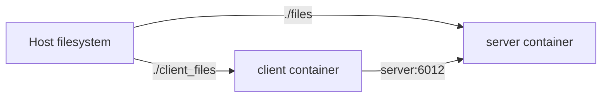

# Docker Deployment

Docker Compose runs the multithreaded server and the interactive client as separate services.



## Requirements

- Docker Engine with Compose v2.
- A free host port, `6012` by default.

## Configure permissions

The containers use the host UID and GID for the bind-mounted data directories. Create a local `.env` file from the example:

```sh
cp .env.example .env
sed -i "s/^DOCKER_UID=.*/DOCKER_UID=$(id -u)/; s/^DOCKER_GID=.*/DOCKER_GID=$(id -g)/" .env
```

`.env` is local configuration and must not be committed.

## Build the images

```sh
docker compose build
```

The server image contains `serv_fich_multithread.py`. The client image contains the interactive client and `watchdog`.

## Use published images

The `main` branch publishes both images to GitHub Container Registry:

```text
ghcr.io/kingjorjai/distributed-systems-cloud-file-service-server:latest
ghcr.io/kingjorjai/distributed-systems-cloud-file-service-client:latest
```

To use a published version instead of building locally, use the registry override and set the image prefix and tag:

```sh
export IMAGE_PREFIX=ghcr.io/kingjorjai/distributed-systems-cloud-file-service
export IMAGE_TAG=latest
docker compose -f compose.yaml -f compose.registry.yaml pull
docker compose -f compose.yaml -f compose.registry.yaml up -d server
docker compose -f compose.yaml -f compose.registry.yaml run --rm client
```

Version tags such as `v1.0.0` are also published when pushed to GitHub.

## Start the server

```sh
docker compose up -d server
docker compose ps
docker compose logs -f server
```

The server is exposed at `localhost:6012` on the host and at `server:6012` inside the Compose network.

## Start the client

Run the client interactively from a second terminal:

```sh
docker compose run --rm client
```

The client connects to the Compose service name `server` and watches `/data`, which is mapped to the host's `client_files/` directory.

Authenticate with the development user `sar` and password `sar`, or `sza` and password `sza`. Then create or modify a file in `client_files/` on the host. It should appear under `files/<user>/` after synchronization.

## Stop the services

```sh
docker compose down
```

The bind-mounted files remain on the host after containers stop. Use `docker compose down --rmi local` to also remove the locally built images.

## Troubleshooting

Inspect the server logs when the client cannot connect:

```sh
docker compose logs server
```

If a bind-mounted directory is not writable, check `.env` and confirm that `DOCKER_UID` and `DOCKER_GID` match `id -u` and `id -g` on the host.
